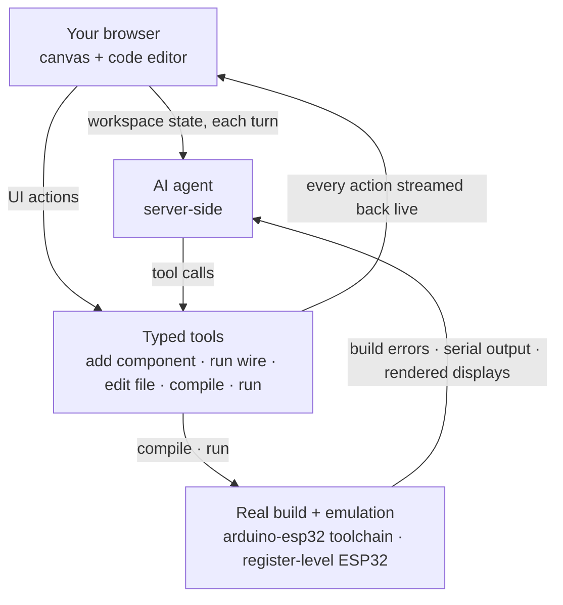

# Velxio: Browser-based ESP32 simulation that runs on real hardware, powered by AI agents

> **Summary**: Velxio is an open-source, browser-based embedded simulator that runs authentic ESP32 firmware on register-level emulated hardware. It combines server-side compilation, SPICE analog co-simulation, real Wi-Fi networking, and an interactive AI agent to design, wire, and execute complex embedded projects without physical hardware.

## Key Takeaways
- **Hardware-Accurate Emulation**: Runs genuine `.bin`, `.hex`, and `.uf2` binaries built via `arduino-cli` and ESP-IDF on a QEMU fork featuring Xtensa LX6/LX7 and RISC-V register-level system emulation.
- **AI Agent Automation**: An integrated AI agent builds interactive circuit schematics, writes multi-file firmware, compiles code, and autonomously verifies execution using real-time feedback loops.
- **Complete Network & Analog Integration**: Supports real Internet communication (TCP, HTTP, MQTT) via virtual NAT access points alongside SPICE-based WebAssembly co-simulation for hybrid analog/digital circuits.

---

## Detailed Overview

One day, I was looking online for a way to emulate a project that used two ESP32 boards communicating over SPI. To my surprise, I couldn't find any platform that could do it. There were a few alternatives capable of emulating a single ESP32, but my project went much further: it also included resistors, diodes, and analog components, making the challenge even greater. That made me wonder: would it be possible to build a platform capable of running an entire embedded project directly in the browser? I decided to build a prototype to find out. That prototype eventually became Velxio.

### What is Velxio?

Velxio is a multi-board embedded simulator delivered as a web app, usable via hosted instances at [velxio.dev](https://velxio.dev) or self-hosted on your own infrastructure. Its core capabilities include:

* **Real CPU emulation, not behavioral models**: ESP32 boards run on a QEMU fork with Xtensa LX6/LX7 and RISC-V system emulation; AVR and RP2040 boards run entirely in the browser via `avr8js` and `rp2040js`.
* **A real compilation chain**: `arduino-cli` and ESP-IDF produce genuine `.hex`, `.uf2`, and `.bin` files server-side. What you run in the simulator is what you'd flash.
* **30+ boards across 6 CPU architectures**: Ten of them belong to the ESP32 family, alongside Arduino AVR boards, Raspberry Pi Pico, STM32 (Blue Pill through F4 Discovery), and Raspberry Pi single-board computers booting Linux on emulated Cortex-A cores.
* **150+ interactive components**: LEDs, sensors, OLED and TFT displays, NeoPixel strips, ePaper panels, MicroSD cards, and motors—all dragged onto a canvas and wired to your board.
* **Hybrid digital + analog co-simulation**: ngspice compiled to WebAssembly solves the analog side: `analogRead()` returns the actual node voltage from Modified Nodal Analysis, ensuring op-amps saturate and diodes drop volts accurately.
* **Arduino, ESP-IDF, and MicroPython development**: Features multi-file workspaces, a library manager backed by the Arduino Library Index, ESP-IDF projects, and 300+ one-click example projects (nearly 80 targeting ESP32-family boards).
* **Fully self-hostable**: The whole stack (frontend, backend, emulators, toolchains) ships as a single Docker image.

### Velxio's Community Today

As of mid-2026, more than 15,000 developers have registered on Velxio, running over a thousand simulations daily. ESP32-family boards account for more than half of those simulations, making them the most popular hardware on the platform. The open-source core at [github.com/davidmonterocrespo24/velxio](https://github.com/davidmonterocrespo24/velxio) has gathered thousands of stars and hundreds of forks.

---

## Deep Dive & Technical Insights

### Hands-on: Your First ESP32 Project in the Browser

You can run an embedded "Hello World" instantly on [velxio.dev/example/esp32-blink-led](https://velxio.dev/example/esp32-blink-led):

1. Open the project link to load an **ESP32 DevKit V1** with an external LED wired to GPIO4 through a resistor (the board's built-in blue LED sits on GPIO2):

```cpp
#define LED_BUILTIN_PIN 2   // Built-in blue LED
#define LED_EXT_PIN     4   // External red LED

void setup() {
  Serial.begin(115200);
  pinMode(LED_BUILTIN_PIN, OUTPUT);
  pinMode(LED_EXT_PIN, OUTPUT);
  Serial.println("ESP32 Blink ready!");
}

void loop() {
  digitalWrite(LED_BUILTIN_PIN, HIGH);
  digitalWrite(LED_EXT_PIN, HIGH);
  Serial.println("LED ON");
  delay(500);

  digitalWrite(LED_BUILTIN_PIN, LOW);
  digitalWrite(LED_EXT_PIN, LOW);
  Serial.println("LED OFF");
  delay(500);
}
```

2. Click ► on the top toolbar to run the project. The backend compiles the sketch with the `arduino-esp32` core and boots the binary on emulated Xtensa LX6 hardware. Within seconds, the LED blinks on the canvas while the Serial Monitor streams `LED ON` / `LED OFF`.


*The ESP32 blink example: code editor, wired circuit, real build log, and serial monitor in one browser tab.*

### Register-Level Emulation & Peripheral Architecture

Velxio avoids simplified behavioral models by utilizing real QEMU system emulation with register-level peripherals for each ESP32-family board:

| Peripheral | Emulation Detail |
| :--- | :--- |
| **GPIO** | Full digital I/O on all pins, wired directly to canvas components |
| **UART** | Multiple UARTs with auto-baud detection, bridged to the Serial Monitor |
| **ADC** | 12-bit multi-channel; reads real solved voltages from SPICE co-simulation |
| **I²C / SPI** | Protocol-level emulation driving OLED, TFT, sensor, and SD components |
| **RMT** | WS2812-timing-accurate NeoPixel strips render accurately |
| **LEDC / PWM** | Hardware PWM channels |
| **Wi-Fi** | Virtual access point (`Velxio-GUEST`) with SLIRP NAT out to the internet |
| **Camera** | ESP32-CAM bridges a real webcam frame into the emulated camera module |

ESP32 sketches compile against the `arduino-esp32 3.3.10` core on ESP-IDF v5.5 inside the backend. By leveraging `ccache` and persistent per-target build directories, warm compiles execute in **under a minute**. Customization options mirror the Arduino IDE Tools menu (partition schemes, CPU frequency, flash mode/size, PSRAM, core pinning) and translate directly into `sdkconfig` at compile time.

ESP32-C3 boards utilize QEMU's RISC-V system emulation (RV32IMC) for full register-level accuracy.


*ESP32 Weather Station: BMP280 over I²C, DHT22 on GPIO, ILI9341 over SPI. Designed, wired, and programmed by the AI agent.*

### Real Wi-Fi & Internet Connectivity

The emulated ESP32 joins a virtual open access point and is NAT'd through the host system. This enables functional `WiFi.begin()`, DHCP, DNS, and TCP communication to the outside world.

```cpp
#include <WiFi.h>
#include <PubSubClient.h>

const char* WIFI_SSID   = "Velxio-GUEST";     // Open AP advertised by emulator
const char* MQTT_BROKER = "broker.hivemq.com";

void connectWiFi() {
  WiFi.mode(WIFI_STA);
  WiFi.begin(WIFI_SSID);
  while (WiFi.status() != WL_CONNECTED) { 
    delay(300); 
    Serial.print("."); 
  }
  Serial.printf("\nWiFi connected, IP %s\n", WiFi.localIP().toString().c_str());
}
```

HTTP clients, proxied web servers, and live MQTT brokers (e.g., `broker.hivemq.com`) operate seamlessly within the simulator environment.

### AI Agent Circuit & Firmware Generation

Velxio features an integrated AI agent that manipulates the live canvas and code editor based on natural language prompts:

* **Designs Circuits**: Selects boards/parts from the 150+ component library, places them on breadboards, and routes pin-to-pin wiring cleanly around components.
* **Writes Firmware**: Generates multi-file code in ESP-IDF, Arduino C++, or MicroPython while managing third-party libraries.
* **Compiles and Iterates**: Runs code through the `arduino-esp32` toolchain. If compilation errors occur, the agent inspects build logs, applies code fixes, and re-compiles automatically.
* **Verifies Execution**: Monitors serial output, inspects rendered state on displays/LEDs, and simulates button presses to confirm functional behavior.



### Supported ESP32 Boards & Multi-Board Canvas

Ten ESP32-family boards across all three major silicon architectures are currently supported:

| Board | Core | Notes |
| :--- | :--- | :--- |
| **ESP32 DevKit V1** | Xtensa LX6, dual-core | Dual-core workhorse with full GPIO |
| **ESP32 DevKit C V4** | Xtensa LX6 | Official Espressif devkit layout |
| **ESP32-CAM** | Xtensa LX6 | Camera module fed by a live webcam feed |
| **Wemos Lolin32 Lite** | Xtensa LX6 | Low-power battery board layout |
| **ESP32-S3 DevKit** | Xtensa LX7, dual-core | Hardware SPI (GPSPI2) peripherals |
| **Seeed XIAO ESP32-S3**| Xtensa LX7 | Ultra-compact form factor |
| **Arduino Nano ESP32** | Xtensa LX7 (ESP32-S3) | Standard Arduino form factor |
| **ESP32-C3 DevKit** | RISC-V RV32IMC | Emulated via QEMU RISC-V |
| **Seeed XIAO ESP32-C3**| RISC-V RV32IMC | Ultra-compact RISC-V board |
| **ESP32-C3 SuperMini** | RISC-V RV32IMC | Mini development footprint |


*The language dropdown in the toolbar set to ESP-IDF, running a FreeRTOS blink example on the ESP32 DevKit C V4.*

Velxio 3.0's multi-board canvas allows direct wiring between different microcontroller boards over UART, I²C, and SPI. An internal `SignalRouter` models the ESP32's GPIO matrix to route peripheral signals dynamically.

### Self-Hosting via Docker

The core emulation suite is open-source under AGPLv3. You can deploy a local server instance containing the frontend, backend, toolchains, and QEMU builds with a single Docker command:

```bash
docker run -d \
  --name velxio \
  -p 3080:80 \
  -v velxio-data:/app/data \
  -v velxio-arduino-libs:/root/.arduino15 \
  -v velxio-arduino-user-libs:/root/Arduino \
  -v velxio-ccache:/var/cache/ccache \
  -v velxio-build:/var/lib/velxio-build \
  ghcr.io/davidmonterocrespo24/velxio:master
```

Once running, navigate to `http://localhost:3080` to access the full platform offline. Persistent volumes maintain compiler caching (`ccache`) to minimize compilation times.

---

## Conclusion & Resources

Velxio streamlines embedded development by combining register-level hardware emulation, authentic toolchains, and real-time networking in the browser. Developers can seamlessly prototype ESP32 applications, verify hardware communication, and export identical binaries to flash directly onto physical microcontrollers.


*The examples gallery: nearly 80 one-click ESP32-family projects.*

### Future Roadmap
* **Browser-Native Emulators**: Lightweight, 100% JavaScript-based emulators for ESP32, ESP32-S3, ESP32-C3, and ESP32-C6 to enable completely client-side, zero-backend execution.
* **ESP32-P4 Support**: Development of P4 emulation to allow early exploration of Espressif's high-performance architecture prior to widespread silicon availability.

### Helpful Links & Community
- **Live Simulator Examples**: [velxio.dev/examples](https://velxio.dev/examples)
- **GitHub Repository**: [github.com/davidmonterocrespo24/velxio](https://github.com/davidmonterocrespo24/velxio)
- **Documentation**: [velxio.dev/docs](https://velxio.dev/docs)
- **Discord Community**: [discord.gg/3mARjJrh4E](https://discord.gg/3mARjJrh4E)